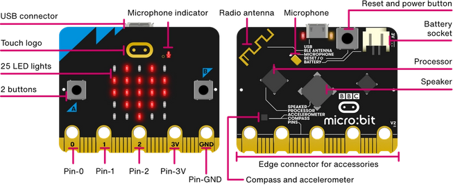

### Last updated: April 16 2021

Please excuse the improper citation format.

***

# Introduction

Welcome to the first Music Computing Workshop! Today, we will focus on familiarising you with the BBC Microbit and some of its features. Don't be intimidated by this, it's just like sheet music but instead of the sheet music telling you what to do, you are using sheet music to tell the Microbit what to do.

Feel free to discuss your thoughts with your peers at any point, or even speak up if you have questions! This is your chance to try out the Microbit and see if it can help you create cool music.

# Task 0 - Different Parts of the Microbit

The Microbit is made up of many little bits and pieces. Take a look at the labeled images below and try and find each of these features on your own device.

Also just a quick explanation on some words I'll be using, when I say Microbit, I'm referring to the little device you're holding, and when I say MakeCode, that's the coding language you'll be using to control the Microbit!

*Note: Should I preload some interactions so that as the students experiment, the Microbit is already responding?*

*Eg. "Some secret sounds have been hidden in them, so play around and see if you can find the hidden sounds"*

# Task 1 - MakeCode

To get started with coding, you need to go onto the MakeCode website. The link to it is [here](https://makecode.microbit.org/).

You can create a new project by clicking on "New Project" and giving your project a name.

# Task 2 - Hello World!

Let's get started with coding straight away! The first step of any programmer's journey is displaying Hello World on the screen, but let's switch it up a bit!

*Livecoding*
On your screen, you should have two *instructions*, play middle C for 1 beat and play middle D for one B. When your program reaches these instructions, it will *execute* them (aka do as it says). We also have a block called "on start". This means whenever the Microbit starts, it will do whatever you've put inside it.

So let's start by dragging the two instructions into the "on start" block. You can see if it works by clicking the start button and asking MakeCode to "play your code".

Time to experiment a little bit: Can you use the play tone instruction to make the Microbit sing a little tune?

# Task 3 - Functions?

Let's take a quick detour to look at song lyrics. Think about a song that you like and how you might write down the lyrics for someone else (assuming you would have to do this by hand and don't have copy paste).

*Can replace with a more curriculum appropriate/relevant song*

*This would probably be a live demonstration?*

For example, here we have the chorus and pre-chorus of Sugar by Maroon 5.

| Pre-chorus                               |  Chorus                                         |
|:----------------------------------------:|:-----------------------------------------------:|
| I don't wanna be needing your love       | Sugar, yes please                               |
| I just wanna be deep in your love        | Won't you come and put it down on me?           |
| And it's killing me when you're away     | I'm right here, 'cause I need                   |
| Ooh baby                                 | Little love, a little sympathy                  |
| 'Cause I really don't care where you are | Yeah, you show me good loving, make it alright  |
| I just wanna be there where you are      | Need a little sweetness in my life              |
| And I gotta get one little taste         | Your sugar, yes please                          |
|                                          | Won't you come and put it down on me?           |

 
Now try singing the song! I've given you the lyrics here.

---

I'm hurting baby, I'm broken down 
I need your loving, loving I need it now 
When I'm without you, I'm something weak 
You got me begging, begging I'm on my knees 
 

(Pre-chorus) 

(Chorus)

---

How did you do it? Did you sing the words chorus and pre-chorus? Of course not, you knew that you should look back at the lyrics I gave before and use the lyrics there. Even if you didn't know the lyrics beforehand, you would be able to sing this song. 

We have *defined* what chorus means in the table, and so when we make a reference to chorus later, we can jump to where we wrote down the lyrics to the chorus and follow that, before we go back to sing the rest of the song. If we called chorus something nonsensical, like potato, you would still be able to follow.

But why did we write it like this? Because writing down the lyrics to the pre-chorus and chorus 3 or 4 different times when they are exactly the same is painful.

Congratulations! You now know how functions work. It's the same thing, except instead of lyrics we give the computer other instructions. That way, we basically have a shorthand way of calling this thing over and over again without having to rewrite it every single time.

Let's try and do this with the Microbit now with the Super Mario theme song. I've given you the basic sheet music here. Can you figure out how to make this song in MakeCode with the help of functions?

*Should I teach conditionals here instead so that it is easier to teach parameters? (eg. One line difference so use an if to determine version a or b)*

*May have to move parameters to workshop 2*

# Task 4 - Now with parameters

So what happens then, when you have a chorus that changes slightly, but is otherwise the same? Do you have rewrite the lyrics each time just for the minor change? Nope! Functions also have another thing called *parameters*, so you can pass it information that it might need to know.

An example is Old MacDonald Had A Farm. It's basically just chorus, over and over again but with minor changes each time. I've given the lyrics. See if you can figure out how to sing the song correctly with this information.

| Chorus                                   |
|:----------------------------------------:|
| Old MacDonald had a farm                 |
| Ee i ee i o                              |
| And on his farm he had some [animal]     |
| With a [sound] [sound] here              |
| And a [sound] [sound] there              |
| Here a [sound]                           |
| There a [sound]                          |
| Everywhere a [sound] [sound]             |
| Old MacDonald had a farm                 |
| Ee i ee i o                              |

 

`Chorus(cows, moo)`

`Chorus(chicks, cluck)`

`Chorus(pigs, oink)`

Similar to how you could figure out how to read the lyrics before, you knew how to fill in the blanks that I left in the chorus "function". That's basically all parameters are!

Now let's try to put it into practice with an [exercise].

*** 

## References
1. [10 Quick Tips for teaching programming](https://journals.plos.org/ploscompbiol/article?id=10.1371/journal.pcbi.1006023)
2. [COMP2300 Intro Lab](https://cs.anu.edu.au/courses/comp2300/labs/01-intro/)
3. [Functions first](https://www.researchgate.net/publication/305221737_The_teaching_of_functions_as_the_first_step_to_learn_imperative_programming)
4. [Code.org](https://www.youtube.com/watch?v=QuIMLel1mmw)